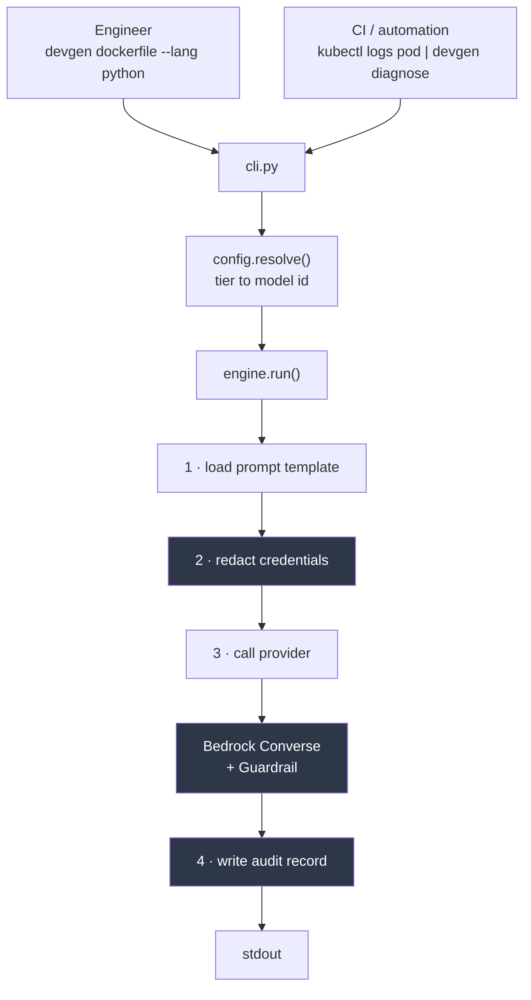

# devgen

An internal AI platform for a DevOps team. Engineers get AI assistance for
generating infrastructure files and triaging failures; the platform enforces
credential redaction, model approval, cost control, and an audit trail — all
provisioned as code.

[](https://github.com/Abdulganiu123/ai-ops-platform/actions/workflows/ci.yaml)

## Why this exists

This is not a Copilot replacement. If you are writing Terraform in your editor,
use Copilot. This covers what an editor-bound assistant structurally cannot do:

- **Run unattended** — a CI job at 3am has no editor open and no seat
- **Enforce house standards** — prompt templates are version-controlled and PR-reviewed
- **Guarantee redaction** — credentials are stripped before the network call, on a path that cannot be bypassed
- **Produce an audit trail** — who ran what, against which model, at what cost

## Architecture



One path through `engine.run()`, so no command can skip redaction or avoid being
audited. A regression test enforces the ordering.

## Quick start

Requires an AWS account with Bedrock model access enabled, Terraform >= 1.15,
Python >= 3.10.

```bash
git clone https://github.com/Abdulganiu123/ai-ops-platform.git
cd ai-ops-platform

python3 -m venv .venv && source .venv/bin/activate
python3 -m pip install -e .

cd terraform
echo 'budget_alert_email = "you@example.com"' > secrets.auto.tfvars
terraform init && terraform apply
```

Terraform writes the Guardrail id to SSM. The CLI reads it at startup, so no
resource id is hardcoded — recreate the infrastructure and the tool picks up the
new id with no code change.

### Optional: the local tier

`--tier local` runs the model on your own machine, so nothing leaves the
network. It requires [Ollama](https://ollama.com) and the model pulled:

```bash
ollama pull gpt-oss:20b     # ~14GB, needs 16GB RAM
```

The model is set in `devgen/models.yaml`. Expect noticeably weaker output than
the hosted tiers — the tradeoff is privacy, not quality.

## Usage

```bash
devgen dockerfile --lang python > Dockerfile
devgen dockerfile --lang rust --tier best

terraform apply 2>&1 | devgen diagnose
kubectl logs checkout-7d9f | devgen diagnose
devgen diagnose --pod checkout-7d9f --lines 500
```

Engineers never type a model id. They pick a tier — `fast`, `balanced`, `best` —
or nothing at all, and get the default configured for that command in
`devgen/models.yaml`. Run `devgen tiers` to see what each maps to.

Measured cost per generated Dockerfile: **$0.000026** on `fast` versus
**$0.000747** on `best` — a 29x spread for identical work, which is the whole
argument for routing by task complexity.

## Phase2-Usage

Diagnosis also runs unattended. An account-level CloudWatch subscription filter
sends any log line matching `ERROR`, `Exception`, or `FATAL` to a Lambda, which
diagnoses it and notifies via SNS — no human involved. It stays silent when the
verdict is `NO FAILURE`, so a broad filter degrades to silence rather than noise.


## Documentation

- [Design decisions](docs/design.md) — why it is built this way, and what it cannot do
- [Security model](docs/security.md) — the four controls, and what is deliberately not logged
- [Incidents](docs/incidents/) — postmortems, which also seed the Phase 3 knowledge base
- [Tool-limitations](docs/limitations.md) - Tool limitations
- [Scope](docs/scope-boundary.md) - what it deliberately does not cover, and why

## Roadmap

| Phase | Scope | Status |
|---|---|---|
| 1 | Governed generation and diagnosis | Done |
| 2 | Event-triggered Lambda, local model for sensitive logs, VPC endpoint | Done |
| 3 | RAG over runbooks and past incidents | |
| 4 | MCP for live infrastructure state | |
| 5 | Org-wide gateway: budgets, allowlists, central audit | |
